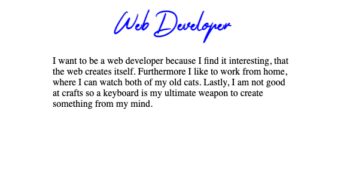

# Goal of this Repository
Build your personal & professional resume with HTML and make it look good.
Anyone can click a few buttons for a webpage, but web developers build their own, referencing their skills.

These are the assignments of my [HTML & CSS Course]() to sharpen your skills.
They are public to anyone, so feel free to accomplish them and build your own HTML Resume.

## Final Result

## Want More?
A [suiting JavaScript Course](https://arnoldcodeacademy.teachable.com/p/javascript-beginner-course) can be found on my [Academy page](https://arnoldcodeacademy.teachable.com/p/javascript-beginner-course).

## Getting Stuck?
It may happen, that you have to google a part of a solution.
It is even conceptual by the tasks that you sometimes have to google.

### Why?

Because knowing how to google is an essential skill for your developer career.
Trust me, technology evolves, you can't remember everything.
Even senior devs (such as I am) google on a daily basis.

## Seeking Help? - You Can Always Reach Me
- If you bought my courses on Udemy, you can reach me there
- Use My Contact Form on my [Academy Page](https://arnoldcode.com/contact-arnoldacademy)
- Or send an [email](mailto:info@arnoldcode.com)
- Write me a Message on [twitter](https://twitter.com/ArnoldAbrahamP1)
- Write me a Message on my [YouTube Channel](https://www.youtube.com/channel/UCfSQ2-Suwq_axrMc8DIxD6g)

# Assigment 01 - Basics
## Task01 - Setup

### Result
It will only be a white screen, but the HTML holds the important content.

For details check out `solutionT1.html` inside the `Solution` folder.

### Tasks

1. Create a folder named "Online Resume"
2. Open that folder as shown in the course with Visual Code
3. Inside that folder create an HTML file and name it "index.html"
4. Fill it with all needed information to be recognized as HTML
5. Open your HTML file in the browser

## Task02 - First Impressions
### Result

### Tasks
1. Change the title to "Hello World"\
(The one that is displayed in the tab of your browser\
when you open your HTML file)
2. Create the element that shows the main header of your page
3. Edit the main header to display "Web Developer"

Hint

- the tag you need is a "header" tag

## Task03 - Fashion Show Preparations
### Result
It will only be a white screen containing the heading. The HTML file holds the important changes.

For details check out `solutionT3.html` inside the `Solution` folder.

### Tasks
1. Create a CSS file
2. Link from your HTML file to your stylesheet

Hint

- the tag you need is a "link" tag

## Task04 - Let the Show Begin 
### Result

### Tasks

1. Add a class in your CSS file that represents the "font-family: Thankfully"
2. Color the heading in blue
3. Change the style of your main header to represent the font family

Hint

- if you use a class you need to use HTML attributes here. You are searching for one that is starts with "cl" and has 5 letters total

### Task05 - 3 Times A Strong "Why"
### Result

### Tasks
1. Add a paragraph below your main header
2. Make the paragraph to be exact 400px wide
3. Edit the content of that paragraph to hold 3 reasons why you want to be a web developer
4. center the heading and the paragraph in the middle of the page

## Want More?

- Claim GRATIS [26 Cheatsheets for Every Web Developer](https://arnoldcodeacademy.ck.page/26webdevcheatsheets)
- Claim GRATIS [8 Rules for Developers to Have a Long-Lasting and Well-Paid Career](https://arnoldcodeacademy.ck.page/8rulesforsuccesfuldevs)
- Enroll in the [suiting JavaScript Course](https://arnoldcodeacademy.teachable.com/p/javascript-beginner-course) at my [Academy](https://arnoldcodeacademy.teachable.com/p/javascript-beginner-course).

